# codingStory

3차 프로젝트 기본설정

프로젝트명 : codingStory

프로그래밍 언어 : JAVA

프레임워크 : Springboot 2.7.11

라이브러리 DI : Spring WEB(MVC), Thymeleaf, Spring Data JPA, Lombok, SpringSecurity5 
               , websocket, validation, OAuth2, security  

데이터베이스 : MySql8

ORM : Spring Data JPA (JAVA(SQL))

개발툴 : IntelliJ

템플릿 엔진 : Thymeleaf (HTML + Data)

빌드 : Gradle

설정 : application.yml, application-oauth2.yml(google,naver,kakao api 키 필요)

기타 설정:
1. setting - gradle 
   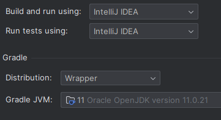  
2. project Structure - SDK -> 11  
   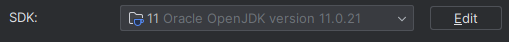  

##  📌 프로젝트 Git 다운로드 주소 📌
$git clone https://github.com/Sim-Ji-Seob/Project3_codingstroy.git  
branch : master

# 📝프로젝트 개요📝
## 🗓️일정
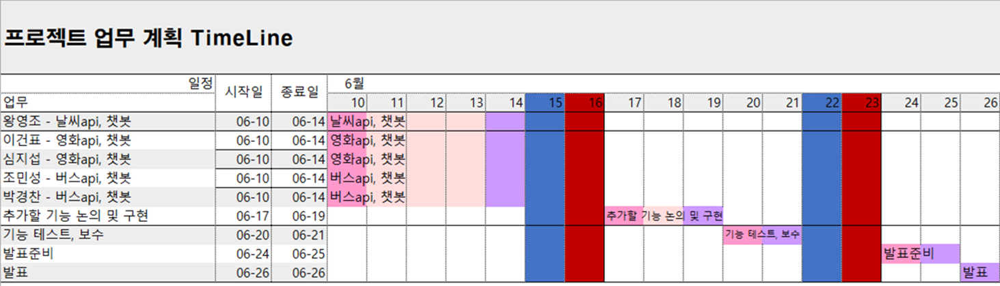  

## 📝개요

프로젝트 개요

3차 프로젝트는 OPEN API DATA를 이용하는 과제입니다. 
영화, 날씨, 버스 API가 과제이고 저는 영화 API를 담당했습니다. 영화진흥원뿐만 아니라 TMDB라는
해외 API 사이트도 이용해서 데이터를 가져왔습니다. 또한 가져온 데이터를 DB에 저장하여 챗봇에도 사용했습니다.

 

## 🖱️개발 환경🖱️
### 💻 프로그램 💻  

### 🛠 개발 환경 🛠  

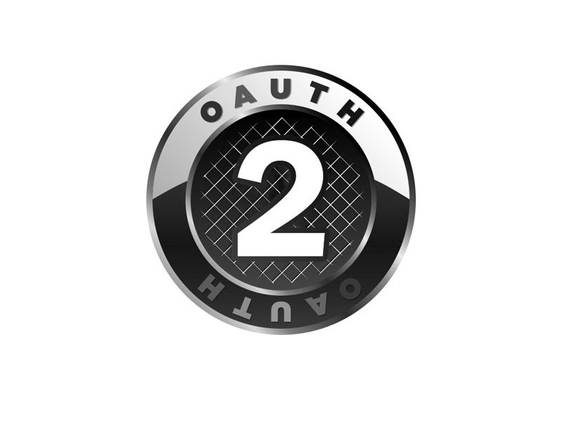  

# ⚡ 팀원별 역할 ⚡
- [ ] 왕** (팀장) : 날씨 API, 날씨 Chat-Bo
- [x] _**심지섭 (팀원) : 영화 API, 영화 Chat-Bot**_
- [ ] 이** (팀원) : 영화 API, 영화 Chat-Bot
- [ ] 박** (팀원) : 버스 Chat-Bot
- [ ] 조** (팀원) : 버스 API

#  🚀 주요 기능 🚀

| 기능             | 설명                                    | 
|----------------|---------------------------------------|
| API 데이터 불러오기   | Open API 데이터를 불러와서 출력(일일/주말/주중 박스오피스) |
| API 데이터 DB에 저장 | 가져온 데이터를 DB에 저장(박스오피스 정보/ 영화 상세정보)    |
| API 데이터로 영화 검색 | TMDB API 통해서 전체 영화 검색                 |
| Chat-Bot       | DB에서 데이터를 불러와 채팅창에 출력                 |

# 📁 프로젝트 상세
### 목차
1. [API 데이터 가져오기](#1-api-데이터-가져오기)
2. [영화 검색](#2-영화-검색)
3. [API 데이터 DB에 저장](#2-api-데이터-db에-저장)
4. [Chat-Bot](#3-chat-bot)

# 1️⃣ API 데이터 가져오기
일일 박스오피스 
   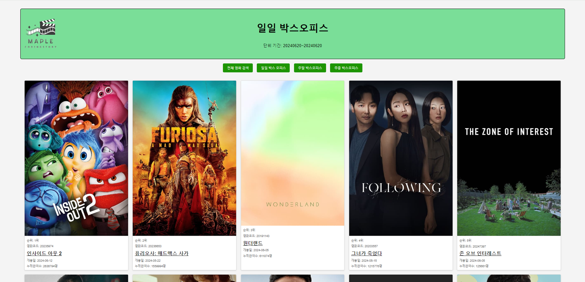  
주말 박스오피스 
   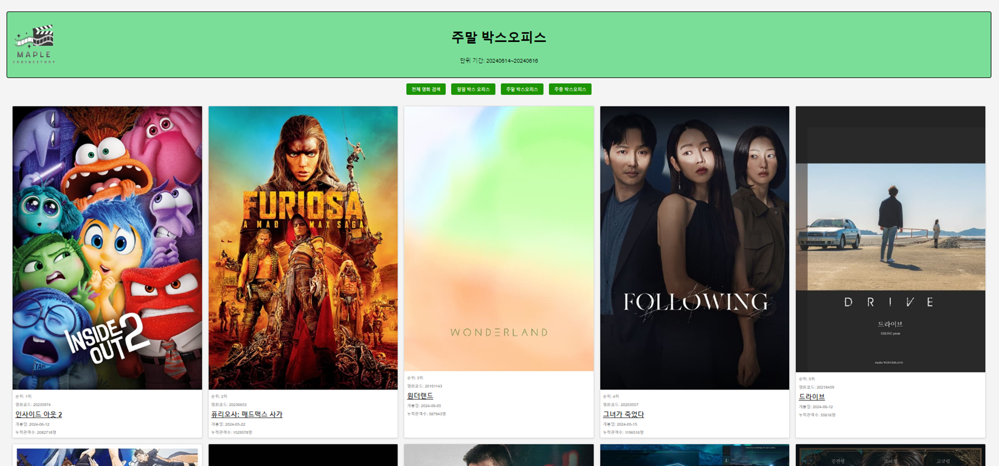  
주중 박스오피스 
   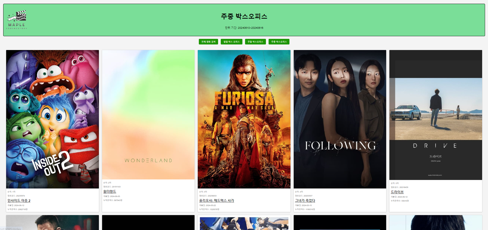  
영화 상세정보 
   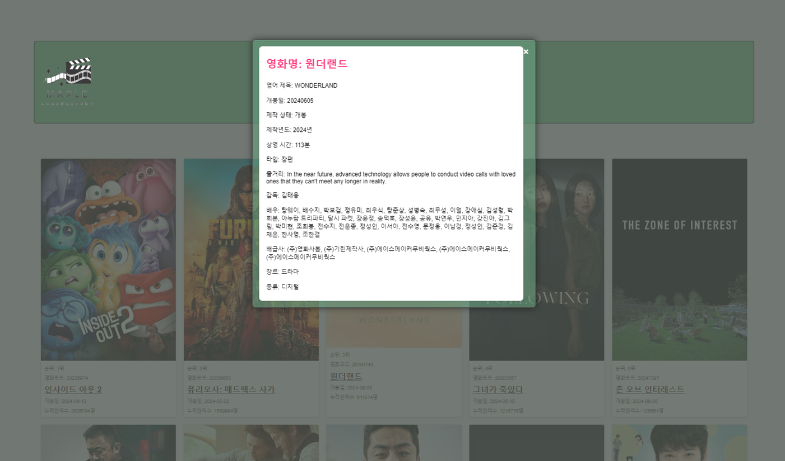  

| API 주소    | 설명                            | 
|-----------|-------------------------------|
| 한국 영화 진흥원 | 일일/주말/주중 박스오피스 데이터  영화 상세정보 |
| TMDB      | 영화 포스터, 영화 줄거리(한/영)           |

# 2️⃣ 영화 검색
TMDB API 를 활용하여 전체 영화를 검색할 수 있다. 
검색하는 키워드가 포함된 모든 영화를 검색하여 보여준다. 

# 3️⃣ API 데이터 DB에 저장
 Open API 주소를 통해 가져온 데이터를 DB에 저장하기 위해 URL 경로를 컨트롤러로 바꿔주어 저장 매서드를 사용 
영화 박스오피스 DB 
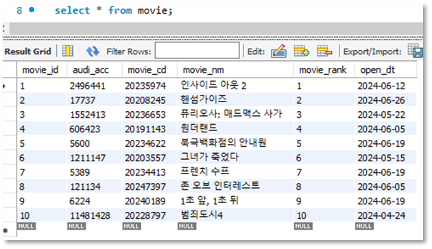  

영화 상세정보 DB 
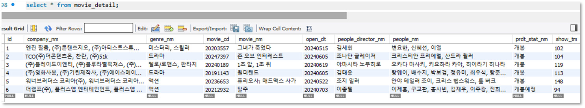 
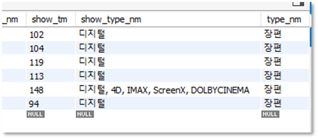  

# 4️⃣ Chat-Bot
챗봇에 처음 접속하게 되면 메세지가 자동으로 출력 
해당 메세지에 오늘/주중/주말 박스오피스 정보가 나오는 버튼 설정 
클릭시 해당 박스오피스 순위를 출력 
영화의 제목을 입력시 해당 영화의 상세정보를 DB에서 가져와 출력 
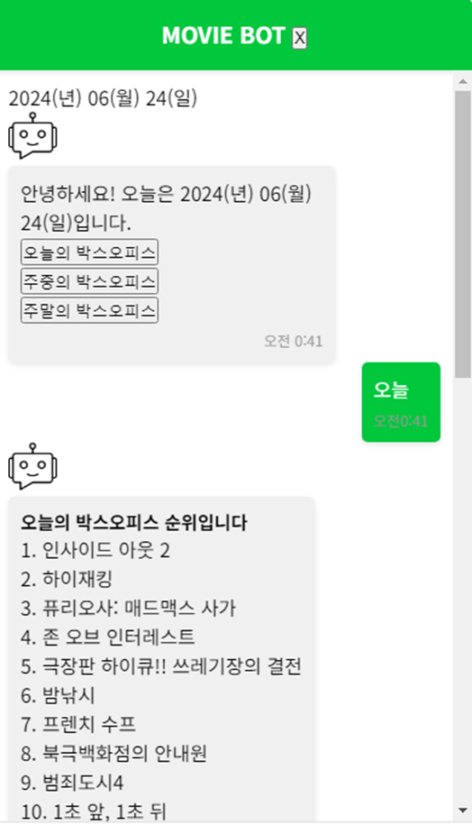 
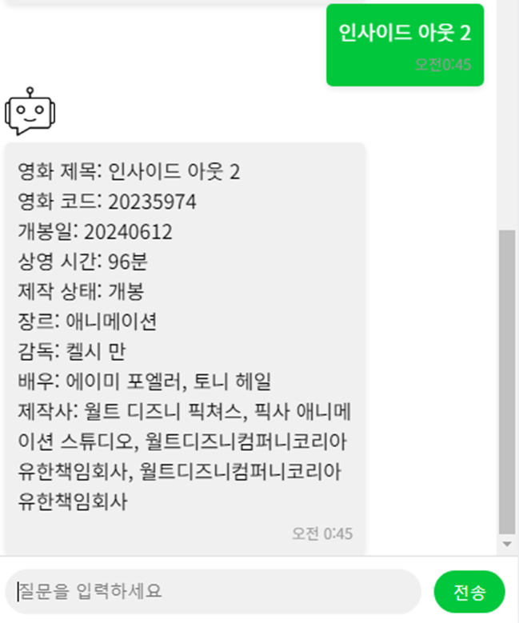  

해당 정보가 없을시 출력되는 메세지 
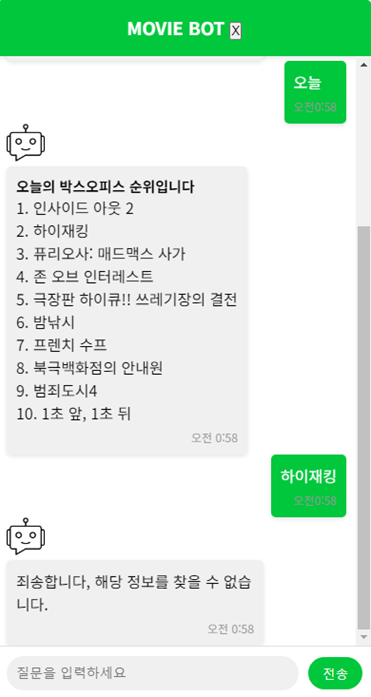  

[⬆⬆맨위로⬆⬆](#codingstory)
